<h1> Hey! Nice to see you.</h1>

I'm **Satish Jhanwer**, working as **Senior Software Engineering Lead @ UnitedHealth Group**. I have **16+ years** of coding experience and build high-performance, scalable UI systems that don't just look good, they endure. My work bridges systems-level frontend engineering and applied machine learning, with a focus on GenAI and RAG.

I recently completed my **M.Tech in AI/ML at IIT Jodhpur**, where I graduated **1st in my batch**. I thrive across React, TypeScript, Node.js, and modern toolchains, but my real impact is in the systems I create: CI/CD-driven component delivery pipelines, testable and maintainable codebases, and UI platforms designed to evolve as products grow. I also enjoy exploring new technologies, mentoring newcomers 👨🏻‍💻, and solving real-world problems ✨.

I've engineered responsive, mobile-first architectures that scale seamlessly across devices and browsers, while integrating WCAG 2.1 AA compliance into the foundation so inclusive experiences are built in by design.

 

---

<h2 align="center">🔥 Languages & Frameworks & Tools & Abilities 🔥</h2>
 

**Frontend**

 

**Backend**

 

**AI/ML**

 

**Database**

 

**Testing**

 

**Soft Skills**

 

**CI/CD**

 

**Cloud & DevOps**

 

**Application Servers**

 

**Security & Quality**

 

**Version Control**

 

**Build & Automation**

 

**Platforms & Collaboration**

 

---

<h2 align="center">⚡ Stats ⚡</h2>
 

  

<picture>
  <source media="(prefers-color-scheme: dark)" srcset="profile/snake-dark.svg" />
  
</picture>

---

<h2 align="center">👨‍💻 Repositories 👨‍💻</h2>
 

 

---

 

  

    This <i>README</i> file is generated <b>every 12 hours</b>! Last refresh: Tuesday, 16 June at 9:53 am IST
     
    <a href="https://medium.com/@th.guibert/how-to-create-a-self-updating-readme-md-for-your-github-profile-f8b05744ca91">Create your own here!</a>
  

  

    
    
    
    
    
  

<!--

-->
